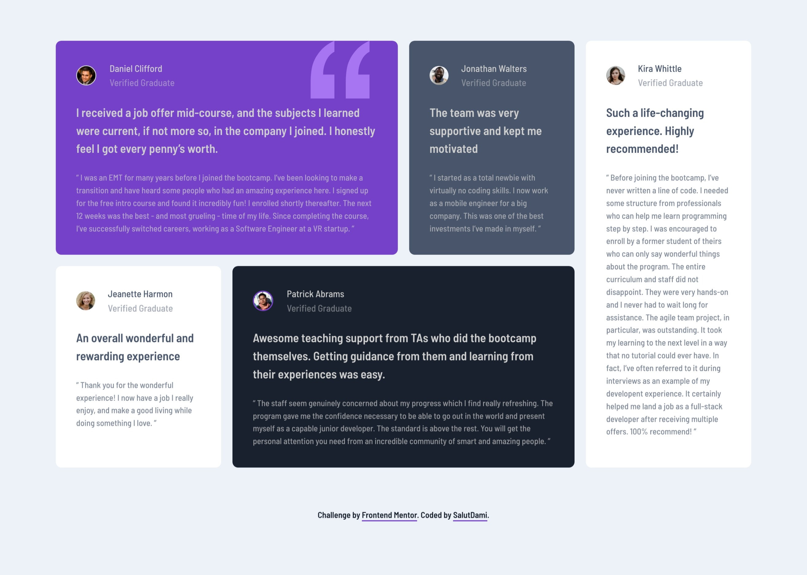
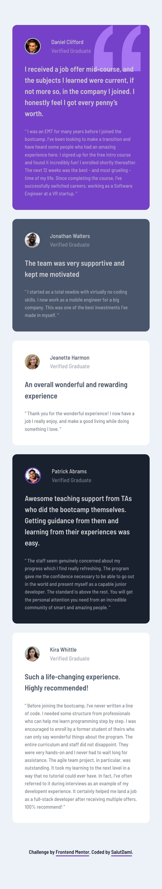

# Frontend Mentor - Testimonials grid section solution

This is a solution to the [Testimonials grid section challenge on Frontend Mentor](https://www.frontendmentor.io/challenges/testimonials-grid-section-Nnw6J7Un7). Frontend Mentor challenges help you improve your coding skills by building realistic projects.

## Table of contents

- [Overview](#overview)
  - [The challenge](#the-challenge)
  - [Screenshot](#screenshot)
  - [Links](#links)
- [My process](#my-process)
  - [Built with](#built-with)
  - [What I learned](#what-i-learned)
  - [Continued development](#continued-development)
- [Author](#author)

## Overview

### The challenge

The users will be able to:

- View the optimal layout for the site depending on their device's screen size

### Screenshot



_A desktop view of the project_



_A mobile view of the project_

### Links

- Solution URL: [Add solution URL here](https://github.com/salutDami/testimonial-grid-section)
- Live Site URL: [Add live site URL here](https://salutdami.github.io/testimonial-grid-section/)

## My process

### Built with

- Semantic HTML5 markup
- CSS custom properties
- Flexbox
- CSS Grid
- Mobile-first workflow

### What I learned

I really enjoyed working with on this project beacause I got to work alot with CSS Grid which was really fun to do.

You can see the code snippet below;

```css
.testimonial_grid {
  display: grid;
  grid-template-columns: 1fr;
  gap: 20px;
}
```

Placing the background image was also soemthing I enjoyed doing as I learnt how to use the background-position property at the right spot at the top 10% away from the right.

```css
.Daniel {
  background-color: var(--moderate-violet);
  background-image: url(../images/bg-pattern-quotation.svg);
  background-repeat: no-repeat;
  background-position: top right 10%;
}
```

### Continued development

I want to keep doing more projects to improve my HTML and CSS.

## Author

- Twitter - [@\_salutDami](https://www.twitter.com/_salutDami)
- Linkedin- [Ikuomola Stephen](https://www.linkedin.com/in/ikuomola-stephen/)
- Frontend Mentor - [@salutDami](https://www.frontendmentor.io/profile/salutDami)
